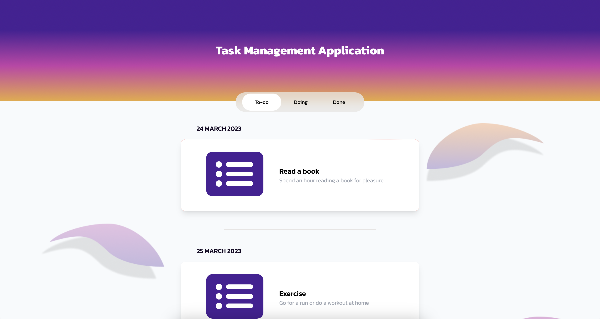

# Task Management Web Application

A task management web application created with Next.js (Typescript), Tailwind CSS (Responsive design)

## Conceptual Design

Theme: Minimal style

Color Palette: Robinhood's website

## Demo

Live demo: https://task-management-pwnr.vercel.app



## Authors

- Pattarapol Wangnirun (Tel: 081-2709300, Email: pattarapol.wangnirun@gmail.com)

## Installation

Install a project with npm & run the development server

```bash
  npm install
  npm run dev
```

## Features

- Tabs for selecting task status (Todo, Doing, Done)
- Load 10 items first then load more data when reach the last item
- Swipe to left > 80% of the box to instantly delete the task
- Swipe to left < 80% of the box to show the delete button
- If we delete all of tasks in that date, that date will disappear.
- Scroll-to-top button
- background images for different screen sizes (Tablet, Laptop, Desktop)

# Explanation

- Delete action affects only the data in the useState. It does not affect the real data so when you switch between tabs, it will return as begin.
- As the fetched data is quite small and the internet is very fast so you may think the web loads all of data in the first time but actually, it loads 10 items and loads more when it reaches the last item. You can use the network tab in Chrome's dev tools to monitor the fetch API mechanism.
